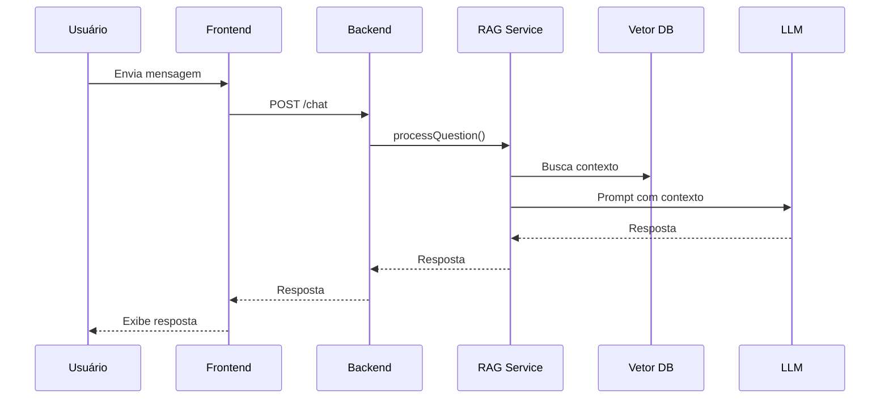

# Fluxo da Aplicação: Do Chat à Resposta da LLM

Este documento detalha o fluxo completo da aplicação, desde a entrada da mensagem do usuário no chat até a resposta final gerada pela LLM (Large Language Model), incluindo exemplos de código para cada etapa.

---

## 1. Usuário envia mensagem pelo chat (Frontend)

O usuário digita uma mensagem na interface do chat e clica em enviar.

**Exemplo (React):**

```jsx
// ChatUI.jsx
function handleSend() {
  fetch("/chat", {
    method: "POST",
    headers: { "Content-Type": "application/json" },
    body: JSON.stringify({ message: userInput }),
  })
    .then((res) => res.json())
    .then((data) => setChat([...chat, { user: "bot", text: data.response }]));
}
```

---

## 2. Frontend faz requisição para o backend (/chat)

A mensagem é enviada via HTTP POST para o endpoint do backend.

**Exemplo:**

```js
// Já mostrado acima (fetch para /chat)
```

---

## 3. Controller recebe a mensagem (chatController.js)

O backend recebe a requisição e repassa para o serviço de RAG.

**Exemplo:**

```js
// src/controllers/chatController.js
app.post("/chat", async (req, res) => {
  const { message } = req.body;
  const resposta = await ragService.processQuestion(message);
  res.json({ response: resposta });
});
```

---

## 4. Serviço de RAG processa a mensagem (ragService.js)

O serviço de RAG (Retrieval-Augmented Generation) executa as etapas:

### a) Gera embedding da mensagem

```js
const embedding = await embeddingService.embedText(message);
```

### b) Busca contexto relevante na base vetorial

```js
const docs = await vectorRepository.search(embedding, { topK: 5 });
```

### c) Monta o prompt para a LLM

```js
const prompt = promptBuilder.build({ question: message, context: docs });
```

### d) Envia o prompt para a LLM

```js
const resposta = await llmService.ask(prompt);
```

---

## 5. LLM gera a resposta

A LLM (ex: Ollama, OpenAI, etc.) recebe o prompt e retorna a resposta.

**Exemplo:**

```js
// src/services/llmService.js
async function ask(prompt) {
  const response = await fetch("http://localhost:11434/api/generate", {
    method: "POST",
    headers: { "Content-Type": "application/json" },
    body: JSON.stringify({ prompt }),
  });
  const data = await response.json();
  return data.response;
}
```

---

## 6. Backend retorna a resposta ao frontend

O backend envia a resposta da LLM para o frontend.

**Exemplo:**

```js
res.json({ response: resposta });
```

---

## 7. Frontend exibe a resposta ao usuário

A interface do chat mostra a resposta recebida.

**Exemplo:**

```jsx
// ChatUI.jsx
setChat([...chat, { user: "bot", text: data.response }]);
```

---

## Resumo Visual



---

> Para dúvidas ou detalhes de implementação, consulte os arquivos: chatController.js, ragService.js, embeddingService.js, vectorRepository.js, promptBuilder.js.
